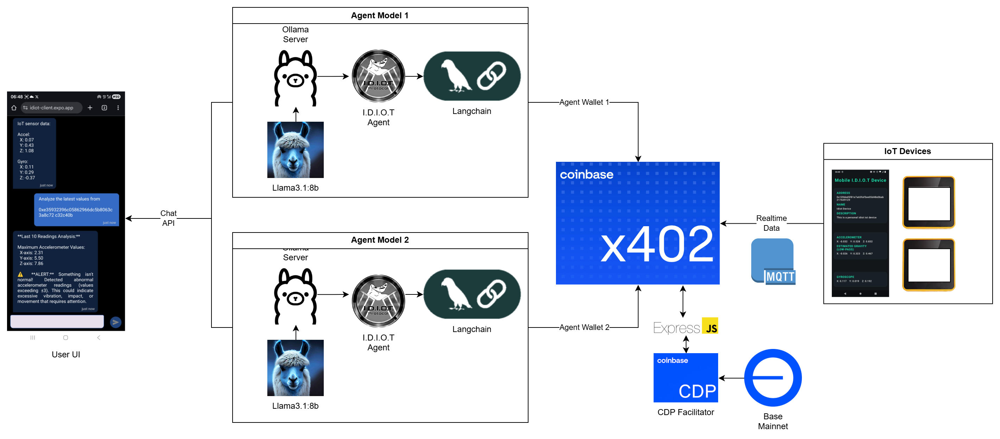

# I.D.I.O.T Protocol

**Intelligent Data Integration for Operational Technology**

A comprehensive IoT ecosystem that combines hardware sensors, AI-powered agents, micropayments, and mobile applications to create a complete end-to-end IoT monitoring and interaction platform.

## I.D.I.O.T Protocol Diagram:



## Overview

The I.D.I.O.T Protocol is a modular IoT platform that enables real-time sensor data collection, AI-powered analysis, and user interaction through multiple interfaces. The system leverages blockchain-based micropayments (x402 protocol) for API access and uses MQTT for real-time data streaming.

## Architecture

The platform consists of six main components:

1. **idiot-iot** - Physical IoT devices (ESP32/M5Stack)
2. **idiot-api** - Data storage and payment-gated API
3. **idiot-agent** - AI agent for natural language interaction
4. **idiot-client** - Mobile app for AI chat interface
5. **idiot-dashboard** - Real-time monitoring dashboard
6. **idiot-device** - Mobile sensor data collection app

## Components

### 1. IoT Device (idiot-iot)

Arduino-based firmware for ESP32/M5Stack devices with IMU sensors.

**Features:**
- WiFi connectivity
- MQTT publishing
- IMU data collection (accelerometer & gyroscope)
- Configurable sampling and transmission intervals
- Automatic reconnection handling

**Hardware Requirements:**
- ESP32 or M5Stack device
- Built-in IMU sensor
- WiFi connectivity

**Configuration:**
```cpp
const char* ssid = "YOUR_WIFI_SSID";
const char* password = "YOUR_WIFI_PASSWORD";
const char* mqtt_server = "YOUR_MQTT_BROKER";
const char* eth_address = "YOUR_DEVICE_ADDRESS";
```

**Data Format:**
```json
{
  "address": "0x...",
  "name": "IMU Device",
  "description": "Location description",
  "data": {
    "accel": {"x": 0.00, "y": 0.00, "z": 0.00},
    "gyro": {"x": 0.00, "y": 0.00, "z": 0.00}
  }
}
```

### 2. API Server (idiot-api)

Express.js server providing payment-gated access to sensor data using the x402 protocol.

**Features:**
- x402 micropayment integration (Base network)
- LowDB for data persistence
- MQTT subscription for real-time data ingestion
- Multiple pricing tiers for different data access levels

**Endpoints:**

| Endpoint                 | Method | Price  | Description                       |
| ------------------------ | ------ | ------ | --------------------------------- |
| `/api/sensors`           | GET    | Free   | List all sensor addresses         |
| `/api/sensors`           | POST   | Free   | Submit new sensor data            |
| `/api/sensors/latest`    | GET    | $0.001 | Get latest reading for a sensor   |
| `/api/sensors/latestTop` | GET    | $0.005 | Get last 10 readings for a sensor |

**Setup:**
```bash
cd idiot-api
npm install
# Configure environment variables
node index.js
```

**Environment Variables:**
```
RECEIVING_ADDRESS=0x... # Your wallet address for payments
```

### 3. AI Agent (idiot-agent)

LangChain-powered AI agent using Ollama for natural language interaction with IoT data.

**Features:**
- Natural language processing with Llama 3.1
- Tool-based architecture for sensor data retrieval
- x402 payment integration for API calls
- Anomaly detection for accelerometer data
- Conversation memory with thread management
- API key authentication

**Tools:**
- `fetchIoTSensorData` - Retrieve latest sensor reading
- `fetchIoTSensorTop10Analysis` - Analyze last 10 readings with anomaly detection
- `fallback` - Friendly greeting handler

**Setup:**
```bash
cd idiot-agent
npm install
# Configure environment variables
node index.js
```

**Environment Variables:**
```
AGENT_PRIVATE_KEY1=0x... # Wallet for sensor data access
AGENT_PRIVATE_KEY2=0x... # Wallet for top 10 data access
FETCH_URL=http://your-api-url
AI_URL_API_KEY=your-api-key
PERMANENT_URL=http://your-agent-url
PORT=8000
```

**API Usage:**
```bash
curl -X POST http://localhost:8000/api/chat \
  -H "Content-Type: application/json" \
  -H "x-api-key: YOUR_API_KEY" \
  -d '{
    "message": "What is the latest sensor data for 0x...?",
    "context": {}
  }'
```

### 4. Client App (idiot-client)

React Native/Expo mobile application for AI-powered chat interaction with IoT sensors.

**Features:**
- AI chat interface
- Sensor data queries via natural language
- Secure storage for API credentials
- Cross-platform (iOS, Android, Web)

**Tech Stack:**
- React Native 0.81.5
- Expo ~54.0
- React Navigation
- Async Storage
- React Native Paper

**Setup:**
```bash
cd idiot-client
npm install
npx expo start
```

**Configuration:**
Create `.env` file:
```
API_URL=http://your-agent-url
API_KEY=your-api-key
```

### 5. Dashboard (idiot-dashboard)

Real-time monitoring dashboard for visualizing sensor data streams.

**Features:**
- Real-time MQTT data visualization
- Interactive charts (react-native-gifted-charts)
- Multi-sensor monitoring
- Historical data display
- Android native build support

**Tech Stack:**
- React Native 0.81.5
- Expo ~54.0
- MQTT.js for real-time data
- React Native SVG for charts

**Setup:**
```bash
cd idiot-dashboard
npm install
npx expo start
# For Android build
npm run android
```

### 6. Device App (idiot-device)

Mobile application that turns smartphones into IoT sensors using built-in accelerometer and gyroscope.

**Features:**
- Access device sensors (accelerometer, gyroscope)
- Real-time sensor data collection
- Data transmission to API
- Cross-platform support

**Tech Stack:**
- React Native 0.81.5
- Expo ~54.0
- Expo Sensors

**Setup:**
```bash
cd idiot-device
npm install
npx expo start
```

## Getting Started

### Prerequisites

- Node.js 18+ and npm
- Arduino IDE (for IoT device)
- Expo CLI
- MQTT broker (e.g., Mosquitto, HiveMQ)
- Ollama with Llama 3.1 model (for AI agent)
- Base network wallet with funds (for x402 payments)

### Quick Start

1. **Set up MQTT Broker:**
   ```bash
   # Using Docker
   docker run -d -p 1883:1883 eclipse-mosquitto
   ```

2. **Deploy API Server:**
   ```bash
   cd idiot-api
   npm install
   node index.js
   ```

3. **Deploy AI Agent:**
   ```bash
   cd idiot-agent
   npm install
   # Ensure Ollama is running with llama3.1:8b model
   node index.js
   ```

4. **Flash IoT Device:**
   - Open `idiot-iot/maincode.ino` in Arduino IDE
   - Configure WiFi and MQTT credentials
   - Upload to ESP32/M5Stack device

5. **Run Mobile Apps:**
   ```bash
   # Client App
   cd idiot-client
   npm install
   npx expo start

   # Dashboard
   cd idiot-dashboard
   npm install
   npx expo start

   # Device App
   cd idiot-device
   npm install
   npx expo start
   ```

## Data Flow

1. **IoT Device** → Collects sensor data (IMU) → Publishes to MQTT
2. **API Server** → Subscribes to MQTT → Stores in LowDB
3. **AI Agent** → Receives user query → Pays for API access → Retrieves data → Analyzes → Returns response
4. **Client App** → User asks question → Calls AI Agent → Displays response
5. **Dashboard** → Subscribes to MQTT → Real-time visualization
6. **Device App** → Collects phone sensor data → Sends to API

## Payment Model (x402)

The platform uses the x402 protocol for micropayments on the Base network:

- **Latest Reading**: $0.001 per request
- **Last 10 Readings**: $0.005 per request
- Payments are automatic and handled by the x402 middleware
- AI Agent has two wallets for different payment tiers

## AI Agent Capabilities

The AI agent can:
- Retrieve latest sensor readings
- Analyze historical data (last 10 readings)
- Detect anomalies in accelerometer data (values exceeding ±3)
- Provide natural language summaries of sensor data
- Handle multiple sensor addresses
- Maintain conversation context

**Example Queries:**
- "What's the latest data from sensor 0x9b5f692e1d1bcbcaa66949d3974cd5247c10ae3e?"
- "Analyze the last 10 readings for abnormal activity"
- "Is there any unusual vibration detected?"

## Development

### Project Structure

```
.
├── idiot-iot/              # Arduino firmware
│   └── maincode.ino
├── idiot-api/              # Express API server
│   └── index.js
├── idiot-agent/            # LangChain AI agent
│   └── index.js
├── idiot-client/           # Mobile chat app
│   ├── src/
│   └── package.json
├── idiot-dashboard/        # Monitoring dashboard
│   ├── src/
│   └── package.json
├── idiot-device/           # Mobile sensor app
│   ├── src/
│   └── package.json
└── assets/
    └── drawio.png
```

### Building for Production

**API & Agent:**
```bash
# Use PM2 or similar process manager
pm2 start idiot-api/index.js --name idiot-api
pm2 start idiot-agent/index.js --name idiot-agent
```

**Mobile Apps:**
```bash
# Build Android APK
cd idiot-dashboard
npm run build
npm run installapp

# Deploy web version
cd idiot-client
npm run webprod
```

## Security Considerations

- API key authentication for AI agent
- x402 payment verification for data access
- Secure storage for private keys
- MQTT authentication recommended for production
- Environment variables for sensitive data

## Troubleshooting

**IoT Device not connecting:**
- Verify WiFi credentials
- Check MQTT broker accessibility
- Monitor serial output for errors

**Payment failures:**
- Ensure wallet has sufficient Base network funds
- Verify receiving address configuration
- Check x402 middleware logs

**AI Agent errors:**
- Confirm Ollama is running with correct model
- Verify API endpoint accessibility
- Check wallet private keys are valid

## License

See LICENSE file for details.

## Contributing

Contributions are welcome! Please open issues or submit pull requests.

## Support

For questions or issues, please open a GitHub issue.